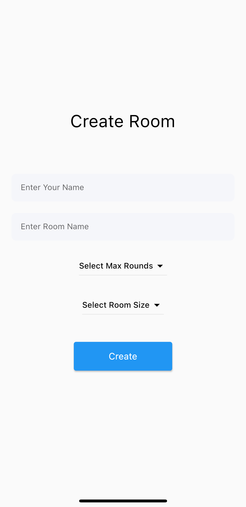
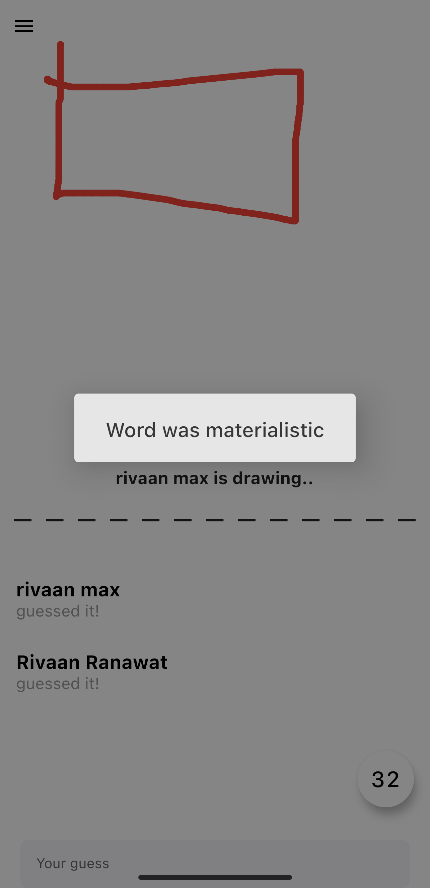
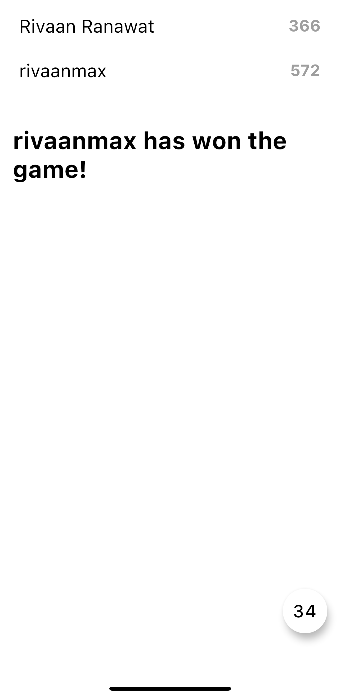

# Skribble.io Application

## Overview

Skribble.io is a cross-platform multiplayer doodling and guessing game. Players can create or join rooms, doodle together, and guess words based on the drawings. The game uses Flutter for the client-side (mobile and web), Node.js, Express, Socket.io, and Mongoose for the server-side. It allows players to change pen width and color, chat, identify correct words, and track scores on a leaderboard.


## Features

- **Creating Room** - Host your own game or join the fun!
- **Joining Room** - Join the existing room.
- **Waiting Lobby** - Chill in the waiting room while players gather.
- **Doodling Features (Everyone In Room Can see)** - Draw together and see each other's creations in real-time.
- **Changing Width of Pen** - Fine-tune your artistic vision with adjustable pen width.
- **Changing Colour of Pen** - Unleash your creativity with a vibrant color palette.
- **Clearing off the Screen** - Start fresh with a clean canvas whenever needed.
- **Drawing** - Express yourself freely with a smooth and responsive drawing experience.
- **Generating Random Words** - Keep the game exciting with a constant stream of new words to guess
- **Chatting In Room** - Chat with your fellow doodlers and strategize your guesses
- **Identifying Correct Words** - Be the first to identify the correct word and earn points
- **Switching Turns** - Take turns drawing and guessing to keep things dynamic
- **Changing Rounds** - Up the challenge by playing multiple rounds
- **Calculating Score** - Track your performance and see who's the doodling champion
- **LeaderBoard** - Compete for glory on the prestigious leaderboard
- **Screenshots** - Capture your masterpieces with a simple screenshot function

## Screen shots

         

## Tech Stack

- **Frontend**: Flutter
- **Backend**: Node.js, Express.js
- **Database**: MongoDB


## Installation

### Prerequisites

- Node.js
- npm or yarn
- MongoDB
- Flutter

### Backend Setup

#### Clone the repository:

```bash
git clone https://github.com/DIVYESH-GITHUB/SKRIBBL_IO.git
cd server
```

#### Installation of dependencies:

```bash
npm install
```

### Frontend Setup

#### Navigate to the frontend directory and install dependencies

```bash
flutter pub get
```


    
### Contact

For any inquiries or feedback, please contact:

- **Name**: Divyesh Pindariya
- **email**: divyeshpindaria09@gmail.com
- **LinkedIn**: https://www.linkedin.com/in/divyeshpindaria/
